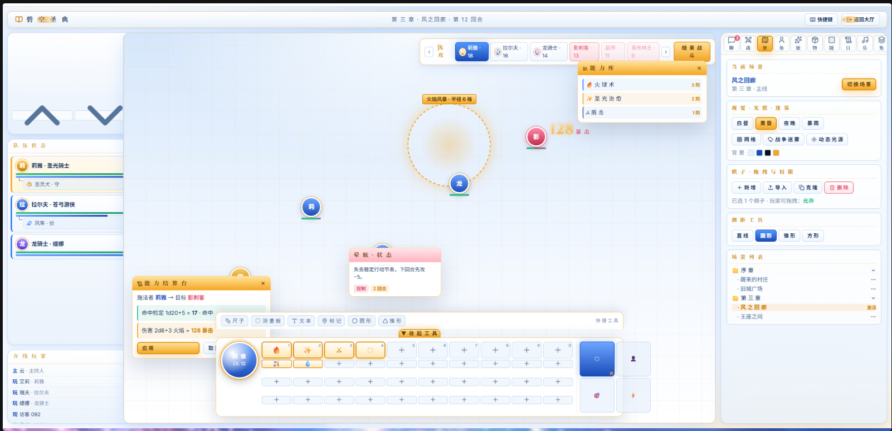

艾尔泽兰特：天穹之剑与命运之星跑团网站规划
简称：AAF
类型：VTT社交沉浸式跑团网站
风格：JRPG（日式奇幻）
规则：结合DND5E,FU（最终物语）构成的D20跑团规则。

网页列表（不包含弹窗等组件）：
page1：入口页面，承载登录注册的任务
page2：大厅页面，承载聊天室、论坛、工具箱、好友系统、跑团大厅（重要）等功能
page3：规则集页面，用户在大厅通过工具箱查询规则、世界观、怪物图鉴等数据时，可以统一调用该页面，且该页面可以作为子页面寄生在page2。
page4：角色创建页面，用户在大厅通过工具箱预创建角色时，可以统一调用该页面，且该页面可以作为子页面寄生在page2。
page5（最高优先级）：世界页面，当用户在page2的跑团大厅加入了某个世界后，进入其对应的世界页面。世界页面承载了跑团的所有核心功能，场景，剧情演出，战斗，日志等等，是核心中的核心。
page7~pageX：可能拓展的页面，目前暂无规划。

优先做完世界页面，其他页面已经有最低可运行骨架。
世界页面功能详述：
注：世界页面在前端视角里分为GM视角、旁观者视角和玩家视角，GM视角拥有更多的功能权限，玩家视角则缺少很多功能，因此需要分开描述。旁观者可以用GM视角旁观，也可以玩家视角旁观，用玩家视角旁观时，观察者可以附身在一名玩家的视角上进行观察。旁观者无法进行任何操作，仅能观看。
注2：网站拥有player，admin，master三种身份，但在世界页面内，只存在GM、玩家和旁观者三种权限。但admin和master可以在系统栏里将自己的玩家权限升格为GM或下调为玩家，或让自己成为旁观者。
前端布局：目前仅考虑PC端，但要考虑到不同屏幕的拉伸，因此需要采用响应式设计，保证在不同分辨率下都能正常显示。容器大小尽量用百分比而不是固定数值。
GM视角功能：
1,命运刻度盘，简称命刻，位于屏幕左上角，这是一个圆形刻度盘，拥有4、6、8、10、12种刻度。默认情况下不显示刻度。鼠标悬停在刻度盘上时，左下角会出现一个设置按钮，点击设置按钮或右键刻度盘都可以唤出命刻菜单，在菜单内可以查看命刻列表，可以新建命刻或删除已有命刻。每个命刻可以设置名称、起始刻度和总刻度数，还可以设置成功触发器和失败触发器，成功的标志是刻度推进到总刻度值，失败的标志是刻度减为负1，负1时直接结束命刻。触发器可以让GM配置触发事件或行为等。在命刻列表，GM可以勾选其中一个命刻，被勾选的命刻会展示在刻度盘上。在设置按钮的上方还有“↑”和“↓”两个按钮，这两个按钮用于快速切换命刻，将刻度盘展示的命刻按照命刻列表的顺序切换到上一个或下一个。在设置按钮的右边还有←和→两个按钮，单击后将刻度盘上的命刻刻度数增加或减少1。
2,队伍状态栏，位于屏幕最左侧居中的位置，命刻的下方。表现为一个长方形矩形容器，作用为展现玩家队伍的简化卡片。每一个玩家的卡片都是长方形，里面有角色姓名、生命值、魔力值和其他关键信息。玩家在自己的视角里，自己的角色卡片默认在最顶部。部分角色拥有召唤物或宠物，这一类被称为“部署”，部署生物的卡片作为一个次级卡片，以层叠的方式附着在主角色卡片的下方，显示部署生物的名称、生命值等信息。玩家可以通过点击角色卡片来查看更详细的信息或进行操作，如使用技能、查看状态等。单击角色卡片可以查看该角色详情。GM可以右键角色卡片进入快速修改页面，在该页面可以快速修改角色的生命值、魔力值等关键信息，修改后直接保存并更新角色卡片上的信息。
3，玩家状态栏，位于屏幕左下角，呈一个小型正方体的模样。这个容器用于呈现玩家的在线状态，位于世界中的在线玩家会一条一条的列出，展示出玩家名字+该玩家绑定的角色的名字。每一条玩家信息的右侧是一个延迟容器，用来显示玩家的延迟状况。玩家信息不会遮挡延迟容器，如果玩家信息过长，多余的部分会自动隐藏。离线玩家会以灰色表示，状态栏中的玩家数量过多，会有滚动条允许下拉，而且有自动排序，离线玩家会自动往底部走，在线玩家会自动往顶部走。
4，场景容器，位于屏幕的中间位置，占据了大部分的空间。这个容器是世界页面的核心部分，用于展示当前场景的内容。场景可以是一个地图、一个战斗场景或者一个剧情演出场景等。GM可以在系统配置板那里将角色、物品或其他东西拖拽到场景容器上进行放置。GM可以拖动场景上的token（棋子）来进行移动，玩家则必须拥有对应的权限，例如默认状态下，玩家只拥有自己绑定的角色和部署的token的移动权限，其他token则无法移动。GM可以在系统配置板里设置玩家的token权限，例如可以允许玩家移动某些特定的token，或者禁止玩家移动任何token。除此之外，玩家默认情况下可以随意移动token，但在战斗情况下，玩家只能在自己的回合中移动token，而且受到移动速度限制，除非玩家拥有回合外移动的能力。场景容器还支持缩放和平移，玩家可以通过鼠标滚轮进行缩放，通过点击并拖动来平移场景。
5，系统配置板，位于屏幕右侧，是一个长方形矩形容器，占据了比较多的空间，因为承载了很多的核心功能。在GM视角里，系统配置板拥有最完善的功能，但是会在玩家视角中大幅度削减。系统配置板拥有聊天栏、战斗序列栏、场景栏、角色栏、能力栏、物品栏、随机栏、日志栏、音乐栏、合集栏、系统栏等多个模块。每一个栏位实际上都是一个页签，在系统配置板的顶部页签栏用图标按上述顺序排开，单击对应图标，系统配置板的主体部分就会切换到对应的栏位。接下来是各个模块详解：
5.1-聊天栏：顶部拥有主频道切换栏和子频道切换栏，主频道为闲聊，扮演和战斗信息频道，子频道为GM创建的各个频道。闲聊频道用于玩家和主持人场外对话，说话时以玩家身份沟通。扮演频道用于玩家和GM进行角色扮演对话，说话时以角色身份沟通。战斗信息频道用于展示战斗时每一次战斗信息的结算，使用战斗卡片。也就是在战斗中每一次的操作在结算完毕后，都会制作成卡片发到战斗信息里面，用来让玩家追溯战斗回忆和核对战斗经过。GM可以右键子频道切换栏以此进入子频道配置弹窗，在弹窗中GM可以新建或编辑或删除频道，设置频道的权限（谁可以看到，谁可以发言），设置频道的颜色等。如果玩家只有频道的观看权限而没有发言权限，那么玩家在该频道里只能看到其他人的发言，但无法参与发言。配置权限的话最好可以批量配置，按照身份组或多选，不然玩家多了看起来很麻烦。GM还可以勾选一个“按场景划分频道”按钮，勾选后每个场景都有一个频道，当GM激活某一个场景后，该频道自动激活并将所有玩家切换到该频道之中，方便玩家在不同场景中有不同的讨论区，避免信息过载。聊天栏主体部分是用来显示聊天信息的，最底部是输入框，玩家可以在输入框里输入信息并发送到当前频道。聊天信息会按照时间顺序排列，每条信息会显示发送者的名字、头像、发送时间和内容等信息。GM可以在聊天栏里设置一些快捷语句或表情，方便玩家快速发送常用的表达。输入框允许输入表情，但不允许导入图片或视频等文件。聊天栏还支持@功能，玩家可以通过@其他玩家来提醒他们注意某条信息。
5.2-战斗序列栏：这个栏位主要用于展示战斗序列，当GM投掷先攻时，所有角色会按照先攻排序，列在战斗序列栏中。每个角色的名字、头像、生命值、先攻等关键信息都会作为小卡片显示在战斗序列栏中。当前轮到哪个角色行动会有明显的标识。随后GM可以在底部点击开始战斗按钮，从而开始一场战斗，在开始战斗前，GM都可以随意修改角色的先攻值以改变先攻序列。底部的战斗按钮左右各有一个←和→，这是切换当前角色回合的按钮，←是回到上一个角色的回合，→是切换到下一个角色的回合。单击某一个角色的卡片可以快速地在场景中定位该角色的token，方便GM在战斗中快速找到该角色的位置。部署不使用独立先攻，部署永远在其主人的回合内进行行动。GM可以看到所有角色的信息，但是玩家只能够看到自己角色（和队友，如果GM开了权限）的信息，怪物和NPC的信息将会被默认隐藏，无法被玩家看到，除非GM开了权限让玩家可以看到怪物和NPC的信息。玩家唯一能看到的就是怪物的名字和先攻值，玩家也可以点击角色来定位，包括怪物和NPC都可以定位，只是无法看到数据。
5.3-场景栏：这个栏位主要用于场景管理。主持人可以创建新的场景。主持人可以创建多级目录用来管理不同的场景，而目录和场景也支持随意拖拽来调整分类和顺序。创建场景时需要输入该场景的名字，随后点击创建即可创建成功。创建成功后立刻打开场景配置弹窗，在弹窗中可以配置场景的所有详细信息，包括名字，网格、光照、战争迷雾、背景色等等。具体的可以见图片参考。
5.4-角色栏：和场景栏类似，GM可以创建目录和角色，目录用来分类管理，而角色则有玩家角色和非玩家角色。每个玩家在首次进入世界的时候会自动进入引导页面来创建角色，角色创建好后会统一存放在默认的“玩家队伍”的目录下并跟该玩家绑定。但GM可以改变角色的目录、绑定的玩家和一切信息。非玩家角色则完全由GM创建和管理，玩家无法看到非玩家角色的相关信息，除非GM开了权限让玩家可以看到非玩家角色的信息。角色栏里每个角色都会有一个详细的角色卡片，卡片上会显示该角色的名字、头像、职业、等级、生命值、魔力值等关键信息。单击角色卡片可以查看该角色的详细信息和属性，还可以进行一些操作，例如使用技能、查看状态等。GM可以右键角色卡片进入快速修改页面，在该页面可以快速修改角色的生命值、魔力值等关键信息，修改后直接保存并更新角色卡片上的信息。关于角色卡的详细字段和设计稍后再议。
5.5-能力栏：能力栏是自动化结算系统的核心（ability system），除了角色卡本身之外的所有资源都可以称为能力，包括种族、职业、背景、职业特性、天赋、状态等等，一切涉及到规则能力和自动化结算的都会存放在这里。能力系统非常的复杂，建议在最后完成，因为多个能力之间会产生联动和绑定，例如战士的职业特性，就会在玩家获得战士等级时自动获得，这个是需要精细打磨的。
5.6-物品栏：和能力栏类似，物品栏是用来存放一切物品资源的，包括武器、防具、消耗品、工具等等。物品栏也非常复杂，因为物品之间也会产生联动和绑定，例如一个药水可能会绑定一个状态，使用后会自动给角色添加这个状态，这个也是需要精细打磨的。而且物品同样涉及到自动化结算，只是因为种类繁多，单独开一栏用来存储。
5.7-随机栏：随机栏是用来存放一切随机资源的，包括随机和牌堆，随机的话就是GM自己创建一个随机列表，需要设置丢多少骰子，不同骰值对应什么样的结果，没个结果都可以绑定物品或触发器等资源。牌堆的话就是GM创建一个牌堆，设置牌堆的名字，牌堆里可以添加任意数量的牌，每张牌可以绑定物品或触发器等资源。GM在游戏过程中可以随时调用随机栏里的随机或牌堆来进行随机抽取，抽取的结果会直接展示出来，并且如果绑定了物品或触发器等资源，还会自动触发对应的效果。
5.8-日志栏：日志栏是用来记录世界中发生的各种事件和操作的，例如玩家的行动、GM的操作、系统的自动结算等等。日志栏可以帮助玩家回顾之前发生的事情，也可以帮助GM追踪世界的发展和玩家的行为。日志栏会按照时间顺序排列，每条日志会显示事件的类型、参与者、结果等信息。GM可以在日志栏里设置一些过滤器，来筛选出特定类型的日志，例如只看战斗相关的日志，或者只看某个玩家的日志等等。GM还可以导出日志作为LOG，导出时可以选择导出全部日志或者按照过滤器筛选后的日志，导出的格式可以是文本文件或者CSV文件等，方便GM进行后续的分析和记录。因为跑团日志中很大一部分来源于各个玩家的聊天信息，因此聊天栏的数据对于日志而言至关重要，支持GM用多种方式组合聊天栏的信息，例如排除掉闲聊频道，或者去除所有系统掷骰，又或者将所有频道结合在一起按照时间排序等。
5.9-音乐栏：音乐栏是GM专属的，用来播放音乐，GM可以创建目录用来分类，可以导入音乐，设置音乐播放列表和随机播放等播放方式。
5.10-合集栏：合集栏的目的是为了让GM将自己编辑好的世界快速打包成一个合集，便于下一次世界使用，或者给其他的GM使用，合集栏会将当前世界的场景、角色、能力、物品等资源打包成一个合集，GM可以选择导出合集，导出的格式可以是一个压缩包，里面包含了所有的资源文件和一个合集配置文件。GM也可以选择导入合集，通过导入合集，GM可以快速地将一个已经编辑好的世界恢复到当前世界中，或者将其他GM分享的合集导入到当前世界中使用。合集栏还支持管理已经创建的合集，GM可以查看已经创建的合集列表，删除不需要的合集，或者编辑已有的合集，例如修改合集的名字、描述等信息。GM导出时可以自由的选择导出哪些资源，例如只导出场景和角色，不导出能力和物品等等，以此来满足不同的需求。
5.11-系统栏：系统栏是世界页面的设置中心，GM可以在这里进行各种设置，例如进入玩家视角（调试用），玩家权限管理，资源包管理（资源包不是合集包，资源包代表的是规则相关的东西，通常涉及底层，例如世界核心资源包，除此之外还有部分扩展，这些扩展类似于合集包，会新增很多资源，但是也可能会给世界带来底层的变动），插件管理（插件是专属于扩展功能的东西，例如开一个快速搜索栏在屏幕中央之类的，这个是属于可以拓展的功能，通常都是新增了前端容器让玩家操作更方便之类，但也有部分涉及到后端），快捷键配置，返回大厅按钮。

6.HUD战斗面板，位于屏幕底部居中的部分，是横向的长方形矩形容器，是玩家战斗时用来快捷操作的面板。整体的UI设计为容器最左侧是一个圆球，用来放置玩家头像，圆球右侧是一个长方形区域，长方形区域的顶部是第一排快捷栏，一共十个按钮，默认对应数字键1~0，玩家可以自定义每个按钮的功能，例如使用某个技能、使用某个物品、切换到某个场景等等。长方形区域的底部是第二排快捷栏、第三排快捷栏和第四排快捷栏，每排快捷栏同样有十个按钮，玩家同样可以自定义每个按钮的功能。长方形区域的最右侧是特殊功能区，一些切换类的能力会放在这里，也就是那种可以主动激活也可以主动关闭，可以两者来回切换的能力。玩家可以在这里控制能力开关，特殊功能区和快捷栏区域会有边界隔开，用来区分作用。玩家单击角色头像，可以打开角色卡详情页面，在角色卡详情页，玩家可以将详情页里面的能力拖拽至快捷栏上，用来配置快捷栏。每一个能力都会作为一个正方形小图标处于快捷栏之中。玩家使用快捷栏上的能力时，取决于不同的能力会有不同的反应，例如玩家点下火球术，那么玩家的鼠标移动到场景容器内时就会跟随着一个测量板，这个是用来测量法术范围的，玩家鼠标左键确认后就会在当前范围释放火球术。如果是选取目标的，那就是按下快捷键后，鼠标单击目标，对目标施展，而且还要判定是否在距离内。如果是直接使用的能力，例如某个状态的开关，那就是按下快捷键后直接生效，不需要再进行其他操作。玩家可以在系统栏里设置快捷栏的配置，例如每个按钮对应的能力是什么，特殊功能区放哪些能力等等。快捷栏的设计需要考虑到玩家在战斗中的操作便利性，因此需要保证快捷栏的响应速度和操作的流畅性，同时也要保证快捷栏的界面清晰，能够让玩家快速找到自己需要使用的能力。在长方形容器居中的最顶部，有一个向上滑出的隐形抽屉，玩家点击抽屉按钮即可唤出抽屉，这个是快捷工具栏，里面是测量板、尺子、文本图标、标记图标等一些临时工具，玩家可以在战斗中随时使用这些工具来辅助操作，例如测量板可以用来测量技能的范围，尺子可以用来测量距离，文本图标可以用来在场景上标记一些文字信息，标记图标可以用来在场景上标记一些符号等等。快捷工具栏的设计需要考虑到玩家在战斗中的实际需求，因此需要保证快捷工具栏的功能丰富，同时也要保证快捷工具栏的界面简洁，能够让玩家快速找到自己需要使用的工具。